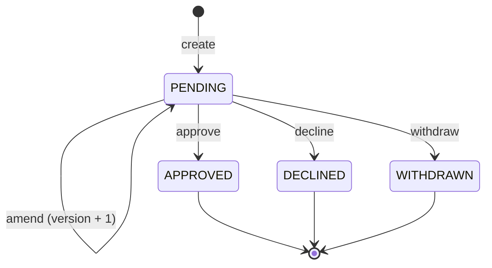

# Basis

A service for pricing exceptions on mortgage applications. A relationship
manager asks for a discount on the standard interest rate; an authorised
reviewer approves or declines it before the application process may use it.

The name is the unit the domain turns on — a basis point — and the grounds on
which a decision is made.

---

## State of this repository

**Read this first.** The service is built in slices, and not all of them are
done. What follows is accurate as of the last commit.

| Area | State |
|---|---|
| Create, amend, decide, withdraw | Built, tested |
| Version-bound decisions, four-eyes, append-only history | Built, tested |
| Idempotent create | Built, tested |
| Every rejection as a problem detail; bounded identity | Built, tested |
| Read endpoints — `GET /requests/{id}`, `GET /requests`, `GET /applications/{id}/approved-exception` | Built, tested |
| User interface — one page at `/`: queue, detail, create | Built. Criteria 7–9 are verified by hand, not by the suite — see [The page](#the-page) |
| Seed data (dev profile), `scripts/demo.sh` and `scripts/demo.ps1` | Built. The seed is tested: absent under the default profile, and checked against the domain invariants under `dev`. The scripts are verified by running them, not by the suite — they need a running service |

72 tests, green. Against the acceptance criteria in `CLAUDE.md`: 1–6 are met and
tested. 7–9 belong to the page and have no automated test — that was a choice,
and the checks are written down under [The page](#the-page) so they can be
repeated rather than taken on trust.

A request can be raised, amended, decided and withdrawn, and the mortgage
process can ask what discount applies to an application. It can be started with
demonstration data, walked end to end by script, or worked through from a page
in the browser.

---

## Running it

A JDK 17 is the only prerequisite. The Maven wrapper fetches everything else,
and the database is in-memory.

```bash
./mvnw spring-boot:run                                     # http://localhost:8080, starts empty
./mvnw spring-boot:run -Dspring-boot.run.profiles=dev      # the same, with demonstration data
./mvnw test                                                # 72 tests
```

Work through it from the page at <http://localhost:8080/> — see
[The page](#the-page) — or explore the API at
<http://localhost:8080/swagger-ui.html>.

### Demonstration data

Under the `dev` profile five requests are loaded at startup, each with the
history its life implies:

| Application | Raised by | State | Discount |
|---|---|---|---|
| `APP-2001` | `rm-1` | `APPROVED` by `reviewer-1` | 30 bp |
| `APP-2002` | `rm-2` | `DECLINED` by `reviewer-2` | 75 bp |
| `APP-2003` | `rm-2` | `PENDING` at **version 2**, amended down from 60 bp | 45 bp |
| `APP-2004` | `rm-1` | `PENDING` at version 1 | 25 bp |
| `APP-2005` | `reviewer-1` | `PENDING` at version 1, **raised by a reviewer** | 20 bp |

Switching identity changes what a caller sees rather than what they are
offered. Nothing verifies identity, so any user id works:

```bash
# a reviewer's queue: the pending requests raised by others
curl -s http://localhost:8080/requests \
  -H 'X-User-Id: reviewer-1' -H 'X-User-Role: REVIEWER'

# a requester's queue: their own, in every state
curl -s http://localhost:8080/requests \
  -H 'X-User-Id: rm-2' -H 'X-User-Role: RELATIONSHIP_MANAGER'
```

`APP-2005` is there to make four-eyes visible. Nothing restricts raising a
request to a relationship manager, so a reviewer can raise one, and the service
then keeps it out of their own queue: `reviewer-1` sees `APP-2003` and
`APP-2004`, while `reviewer-2`, asking the same question, also sees `APP-2005`.
`reviewer-1` can still reach it by identifier —
`/requests/5eed0000-0000-4000-8000-000000000005` — but a decision is refused
with `403`. The rule is applied by the query and by the decision. The page
also withholds the approve control on a request its own caller raised, but that
is a courtesy: the service refuses regardless, and says why.

The data is opt-in on purpose. It lives in `src/main/resources/seed/data.sql`
and only the `dev` profile names it, because Spring Boot would run a
classpath-root `data.sql` under every profile, including the tests', which count
rows and assert what a queue does *not* contain. Without the profile the service
starts empty and the tests run against a database no fixture has touched.

### The page

One static page, served at `/` with no build step and no network: the
stylesheet is committed, not loaded. It is a thin client over the same API and
holds no rule the service lacks — every bound, transition and refusal comes from
the service, and what the service says is what is shown.

The **identity switcher** in the header sets `X-User-Id` and `X-User-Role` on
every call. It is kept per tab, so two tabs can be two people. Switching changes
what the queue *contains*, not which buttons are hidden.

A walk that shows the contested requirement, on the seeded service:

1. Tab A, as `reviewer-1` (`REVIEWER`): open `APP-2004`. The decision panel says
   the decision is recorded against **version 1**.
2. Tab B, as `rm-1` (`RELATIONSHIP_MANAGER`): open `APP-2004`, change the
   discount, **Amend**. It is now at version 2.
3. Tab A: **Approve**. Nothing is recorded. The page explains that the request
   changed while it was open, names the current version, and offers to reload;
   the panel then names version 2.

Things about the page that are decisions rather than accidents:

- **What is offered follows role, ownership and status.** A reviewer is offered
  the decision panel on a `PENDING` request they did not raise; a relationship
  manager is offered amend and withdraw on a `PENDING` request they did raise;
  a terminal request offers nothing. `CLAUDE.md` says both that role decides
  what is offered and that no approve control appears on a request reached
  directly by its own requester; this is the reading that satisfies both. Its
  consequence is that **a reviewer who raised a request cannot amend or withdraw
  it from the page**, though the API would allow it. Every attempt is still
  decided by the service, and a refusal is shown in its words.
- **It never refreshes an open request by itself.** A version changing under a
  reviewer's eyes without their noticing would defeat the binding the page
  exists to show. A stale view costs one `409`, which is explained.
- **It validates nothing.** No `min`, `max` or `required` attributes, so a bad
  value is refused by the service and shown as it said, and the bounds live in
  one place.
- **Text is inserted as text, never as markup.** A reason is written by one
  person and read by another with authority to approve it.
- **Times are shown in UTC**, from the string the service sent, and every
  discount as basis points beside percentage points (`25 bp`, `0.25 percentage
  points`).
- **The create form's `Idempotency-Key` is made once per opening** and reused on
  every attempt, so a retry is a replay. It is built from `getRandomValues`
  because `crypto.randomUUID` does not exist when the page is opened over plain
  HTTP by a machine's address.

**Pico.css 2.1.1**, the classless build, is committed under
`src/main/resources/static/vendor/` with its MIT licence beside it. It was taken
from the npm package `@picocss/pico@2.1.1` (integrity
`sha512-kIDugA7Ps4U+2BHxiNHmvgPIQDWPDU4IeU6TNRdvXQM1uZX+FibqDQT2xUOnnO2yq/LUHcwnGlu1hvf4KfXnMg==`)
once, and is never fetched at runtime or build time.

**How it was verified.** Criteria 7–9 have no automated test: `CLAUDE.md` puts
them under manual verification, and a browser test stack would be a dependency
this project has decided not to take. They were checked by hand against the
service — 7: `/` renders fully styled and makes requests to the service only,
from a start with no profile; 8: the two-tab walk above; 9: as `rm-1` create,
amend, then as `reviewer-2` approve, and separately create and withdraw. To
repeat them, follow those steps. The suite's 72 tests are unaffected by the
page's existence.

### The demo scripts

One scenario, end to end, narrated — the same eight steps in the same words in
two scripts, so it runs without a prerequisite on either platform. Start the
service in one terminal, then in another:

```bash
scripts/demo.sh                  # macOS, Linux, Git Bash
```

```powershell
.\scripts\demo.ps1               # Windows PowerShell 5.1 or later
```

Either takes a base URL if the service is not on port 8080
(`scripts/demo.sh http://host:port`, `.\scripts\demo.ps1 -BaseUrl http://host:port`).
If Windows refuses to run a local script, use
`powershell -ExecutionPolicy Bypass -File scripts\demo.ps1`.

| Step | What it does | Answer |
|---|---|---|
| 1 | A relationship manager raises a request | `201`, `PENDING` at version 1 |
| 2 | The same create is retried with the same `Idempotency-Key` | `201`, the first response byte for byte |
| 3 | The requester amends it | `200`, version 2 |
| 4 | A reviewer approves version 1, which has moved on | `409`, naming version 2 |
| 5 | The reviewer approves version 2 | `200`, `APPROVED` |
| 6 | The requester tries to approve their own request | `403` |
| 7 | The mortgage process reads the approved discount | `200`, 40 bp |
| 8 | The history is read | newest first, each entry naming its version |

A step that does not answer what it narrates stops the script with `MISMATCH`
and a non-zero exit, so a demo cannot say "this is refused" and carry on after a
success. Each run uses an application identifier of its own, so it behaves the
same on an empty instance, a seeded one, or a second run against either.

The scripts are not part of `./mvnw test`: they need a running service on a
port, and the suite must stay a single command with no prerequisite. What they
narrate the integration tests assert in JUnit.

### By hand

Or start by creating a request yourself:

```bash
curl -i -X POST http://localhost:8080/requests \
  -H 'X-User-Id: rm-1' -H 'X-User-Role: RELATIONSHIP_MANAGER' \
  -H 'Idempotency-Key: demo-1' -H 'Content-Type: application/json' \
  -d '{"applicationId":"APP-1","discountBps":25,
       "reason":"Retention case for a long-standing client"}'
```

Send it a second time with the same key: the same `201`, the same body, the
same request. Change the discount and send it again with that key still: `422`.

Then approve it as someone else — the requester may not decide their own
request:

```bash
curl -i -X POST http://localhost:8080/requests/{id}/decision \
  -H 'X-User-Id: reviewer-1' -H 'X-User-Role: REVIEWER' \
  -H 'Content-Type: application/json' \
  -d '{"decision":"APPROVE","version":1,"note":"Within delegated authority"}'
```

Then ask what the mortgage process would ask:

```bash
curl -s http://localhost:8080/applications/APP-1/approved-exception \
  -H 'X-User-Id: pricing-service' -H 'X-User-Role: RELATIONSHIP_MANAGER'
```

Everything is in memory, so restarting empties it.

---

## The problem as understood

A discount on the standard rate is a commercial commitment, so someone other
than the person asking for it has to agree. The service exists to make that
agreement auditable: at any later date it must be able to answer **what was
approved, by whom, and when** — without ambiguity, and without depending on
anyone's memory of what the request said at the time.

That last clause is what makes this more than a form with an approve button.

## The contested requirement, and how it is resolved

The brief pulls in two directions. One stakeholder wants the relationship
manager to be able to change a request after submitting it. Another wants an
approval to apply to exactly the request that was reviewed. Taken literally,
both cannot hold: if the request can move, an approval recorded against "the
request" means nothing.

**Resolution: versioned requests, version-bound decisions.**

- A request may be amended only while `PENDING`. Each amendment increments its
  `version` and appends a history entry.
- A reviewer submits the `version` they reviewed. If it is no longer current,
  the decision is rejected with `409` and the request must be reviewed again.
- After a decision the request is terminal and never changes.

Both stakeholders get what they asked for, and the audit question stays
answerable: an approval names a version, and that version's contents are in the
history. Nobody has to reconstruct what the request said last Tuesday.

The cost is a reviewer who occasionally has to look again. That is the correct
cost — the alternative is approving something that has since changed.

---

## How it works

### States



Every illegal transition answers `409`. Terminal means terminal: no code path
mutates an `APPROVED`, `DECLINED` or `WITHDRAWN` request.

### The two tables

`exception_request` holds **what is true now** — one row per request, updated in
place. `request_history` holds **how it got there** — one row per transition,
inserted and never updated or deleted. The duplication is deliberate: the
current row is a cache of where the log ended up.

Each history entry records the transition, the actor, the version that entry
concerned, and a payload of the values it carried — the discount and reason for
`CREATED` and `AMENDED`, the reviewer's note for a decision. The note has no
column on the request because it belongs to the decision, not to the request,
and the decision is history.

`idempotency_record` holds one row per create, keyed `(key, caller)`, carrying
the response that create produced.

### The guard

This is the decision the rest of the design follows from.

The version and status checks live **inside** the write:

```sql
UPDATE exception_request
   SET ...
 WHERE id = ? AND version = ? AND status = 'PENDING'
```

`rowsAffected == 0` means the request moved, and the caller gets `409`.

The alternative — read the row, compare in Java, then write — passes every
single-threaded test and loses races. Two reviewers acting on version 2 would
both read version 2, both find it current, and both write. `ConcurrentAmendmentTest`
exists to fail if the guard is ever moved out of the statement.

Idempotency follows the same rule: the create inserts against the `(key, caller)`
constraint and catches the violation. It never checks whether the key exists
first.

Rules that *cannot* race — four-eyes, the reviewer role, ownership of an amend
or withdrawal, field validation — are evaluated in Java before the write, where
they produce a much better error message. The two sets are disjoint; no rule is
enforced in both places.

### A detail worth knowing

A retry is recognised by comparing against the **stored response**, not against
the request row. The row moves when the request is amended, so an RM who
creates at 25 bps, amends to 40, and then retries the original create would
otherwise be told `422` for the body they first sent. The stored response is
frozen at creation and is the only record of what was originally submitted.

History is returned newest first, ordered by the version each entry concerned,
then by time, then by the transition — a decision sorts after the entry it
reviewed. The last part is not belt and braces: `Instant.now()` is granular to
a millisecond or worse on some hosts, so an amendment and the decision
reviewing it can share a timestamp, and without that tiebreaker the trail
displays in either order. The state machine allows at most one such pair per
version, which is what makes the order total.

---

## API

Identity is carried by `X-User-Id` and `X-User-Role`, standing in for claims
that a JWT would carry in production. **Nothing verifies them.** Authorisation
is real and tested; authentication is not built.

| Method | Path | Notes |
|---|---|---|
| POST | `/requests` | Requires `Idempotency-Key`. `201` with `Location` |
| PATCH | `/requests/{id}` | `{discountBps?, reason?, version}` — at least one of the two. Requester only, while `PENDING` |
| POST | `/requests/{id}/decision` | `{decision, version, note?}`. Reviewer only, not the requester |
| POST | `/requests/{id}/withdrawal` | `{version}`. Requester only |
| GET | `/requests/{id}` | Current values and the full history, newest first |
| GET | `/requests` | The queue for the caller. Reviewer: `PENDING` requests raised by others. Requester: their own, in every state. `?status=` narrows either |
| GET | `/applications/{id}/approved-exception` | What the mortgage process consumes. `404` when nothing is approved |

| Situation | Code |
|---|---|
| Created | `201` + `Location` |
| Read, amended, decided, withdrawn | `200` |
| Idempotent replay | the original status and body, unchanged |
| Validation failure, missing or blank `Idempotency-Key` | `400` |
| Wrong role, or the requester deciding their own request | `403` |
| Unknown request, or an application with nothing approved | `404` |
| Stale version, or an illegal transition | `409` |
| A key replayed with a different body | `422` |

Every non-2xx response is an RFC 7807 problem detail with a title and a detail
a person can act on. A `409` states the current version and says to re-read the
request rather than resubmit with the number it just quoted — that number is
advisory and may itself be stale by the time the caller sees it.

---

## Assumptions

- **Applications and users are opaque strings.** The service stores and returns
  them without interpreting them. There are no tables for either, and an
  application identifier is not checked against anything, so a non-existent one
  is accepted. In production it would be validated against the mortgage system.
- **An application may accumulate more than one approved exception.** The one
  with the most recent `decided_at` applies. Supersession is not modelled —
  terminal requests are immutable, so an earlier approval is never marked
  superseded, and the rule is inferred rather than recorded. Production would
  add a `SUPERSEDED` status and a `superseded_by` link, guarded by a partial
  unique index on `(application_id) WHERE status = 'APPROVED'`, so the chain is
  a fact rather than a derivation. This is the weaker choice and is called out
  deliberately.
- **The discount is bounded at 1–200 basis points**, as a named constant. The
  real threshold is a policy decision, not a known business rule.
- **Retention, availability and data-protection requirements were not
  specified** and have not been invented.

## Open questions for the business

Points where the brief does not decide and the service had to. Each states the
behaviour built, so nothing is silently undefined. None is a technical choice.

- **An approved exception does not expire.** Once approved, the discount stays
  available indefinitely. Nothing suggests a validity period, but an indefinite
  discount is a commercial exposure — a question for the business rather than a
  duration to invent.
- **A reviewer cannot counter-offer.** Approve means approve the requested
  amount exactly. Letting the reviewer change the amount would make them the
  requester and break four-eyes, so a lower amount requires a decline and a new
  request — which loses the link between the two.
- **Anyone may raise a request, including a reviewer.** Nothing restricts
  creation to a relationship manager, and four-eyes still stops a reviewer
  deciding their own. If raising a request is meant to be an RM's act alone,
  that is a role check to add.
- **Only the requester may amend.** A third party's amendment is rejected,
  matching withdrawal. The restrictive reading is deliberate: relaxing it later
  is safe, tightening it later invalidates requests already amended.
- **An amendment must change something.** A `PATCH` carrying only a version is
  rejected, because a version bump that alters nothing still forces a reviewer
  to start again. This removes a possible way to deliberately force re-review;
  withdrawal already exists for taking a request back.
- **`X-User-Id` is bounded at 128 characters.** That number comes from the
  column width, not from any stated rule. Real authentication would carry the
  identity as a verified claim and make the bound the provider's business.

---

## Deliberately not built

Named so that their absence reads as a decision rather than an omission.

- **Real authentication** (OIDC / Entra ID). Identity is two headers.
- **Postgres and Flyway.** H2 in-memory with `schema.sql` means the service
  runs with nothing but a JDK.
- **Testcontainers.** The same reasoning.
- **Event publishing to downstream consumers** via a transactional outbox.
- **A persistent idempotency store with a TTL.** Records live in the same
  in-memory database and vanish on restart, so a retry arriving after a restart
  creates a second request. Nothing expires or is swept.
- **Observability.** No metrics, no tracing. See the note on the `409` rate
  below for the one number that would be worth watching first.
- **JPA/Hibernate** (dirty checking works against immutability, and mapping
  buys nothing at three tables), **Lombok** (records suffice), **Spring
  Security** (identity is stubbed), and any JavaScript framework.

## What would change before production

In rough order of importance:

1. **Real authentication**, and with it the removal of every `X-User-Id` header
   read. The authorisation rules stay exactly as they are; only where identity
   comes from changes.
2. **Supersession modelled rather than inferred**, as described under
   Assumptions. "The most recent approval applies" is a rule living in a query
   instead of in the data.
3. **Postgres, with the application's database role holding no `UPDATE` or
   `DELETE` on `request_history`.** Append-only is currently a convention kept
   by code discipline; nothing in H2 enforces it. That guarantee belongs in the
   database.
4. **A persistent idempotency store with a retention period**, and something
   that sweeps it. The table currently grows without bound and is emptied only
   by restarting.
5. **Observability**, starting with the `409` rate.
6. **A validity period for approvals**, once the business answers whether one
   exists.

---

## Operational notes

**If the service misbehaves, check in this order:**

1. **Is it a `409` storm?** That usually means reviewers are working from a
   stale queue, not that the service is broken. See below.
2. **`request_history` should only ever grow.** If an entry has changed or
   disappeared, the audit guarantee is gone and that is the most serious thing
   that can happen here. No code path writes anything but an `INSERT`; that is
   the first thing to verify if it is ever in doubt.
3. **A request that is terminal but still changing** would mean the status
   guard has left the `UPDATE` statement. Same check: read the SQL, not the
   Java around it.
4. **Everything is in memory.** After a restart there is no data, and that is
   expected rather than a fault.

**What a rising `409` rate would mean.** A `409` is not an error in the usual
sense — it is the version guard doing its job. A low steady rate is healthy. A
rising one means decisions are being submitted against versions that have
already moved, which points at people, not code:

- Reviewers working from a queue they loaded some time ago.
- Relationship managers amending requests while they sit under review.
- Two reviewers looking at the same request.

The page adds nothing to this rate by itself: it never refreshes an open request,
so a `409` from it is a real concurrent edit, explained with the current version
and a button to reload.

The fix is a shorter path between reading a request and deciding it, not a
looser guard. If the rate is ever driven down by relaxing the version check,
the service has stopped answering the question it exists to answer.

There is nothing measuring this today — observability is out of scope — so it
would be the first metric to add.

---

## Repository layout

```
src/main/java/com/example/basis/
    ProblemDetailAdvice.java        every non-2xx answer, in one place
    request/
        ExceptionRequestController  HTTP; reads the identity headers
        ExceptionRequestStore       the SQL, and the transaction boundary
        ExceptionRequest            the request, with the rules that cannot race
        RequestStatus, EntryType, Decision, UserRole
src/main/resources/schema.sql       three tables, with the reasoning in comments
src/main/resources/seed/data.sql    demonstration data, loaded only by the dev profile
src/main/resources/application-dev.properties   names the seed; the default profile does not
src/main/resources/static/index.html            the page: markup, script, no build step
src/main/resources/static/vendor/               Pico.css, committed, with its licence
scripts/demo.sh, demo.ps1           the same scenario for bash and PowerShell
openspec/                           the specs, and the change history behind them
```

There is no service layer. Each store method is one transactional unit
corresponding to one transition, which is the granularity a service layer would
have had, and the domain rules live on the records as pure functions — which is
what lets them be unit-tested with no Spring context and no database.

## How the work is organised

Each slice is an OpenSpec change under `openspec/changes/` carrying its
proposal, spec delta, design and tasks. `openspec/specs/exception-request/spec.md`
is the current behaviour contract.

Tests and implementation are written in **separate sessions**, on purpose: a
test written alongside the code it tests encodes the same misreading twice.
Tasks name the acceptance criterion they satisfy so the test can be written from
the criterion rather than from the implementation.
